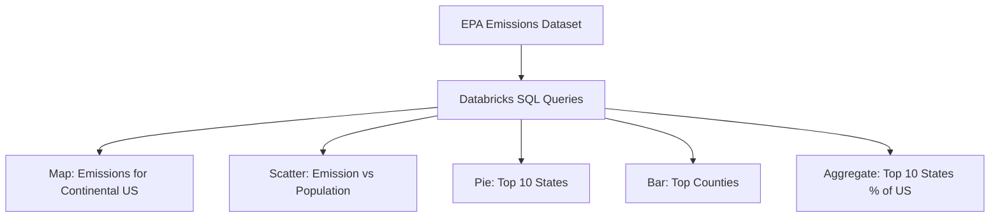

# United States Emissions Dashboard (EPA 2023)

## 📖 Overview
This project visualizes greenhouse gas (GHG) emissions across the United States using EPA 2023 data.  
It highlights geographic distribution, per‑capita emissions, and concentration of emissions in specific states and counties.  
Built with **Databricks SQL** and designed for reproducibility and open collaboration.

---

## 📂 Repository Structure

```
emissions-dashboard/ 
├── README.md 
├── queries.sql 
├── emissions_dashboard.ipynb 
├── schema.md 
├── sample_data.csv 
├── media/ 
│ ├── scatter_plot.png
│ └── bar_plot.png 
└── LICENSE

```

---

## 📊 Data Source
- **EPA Emissions Dataset (2023)**  
- Columns include: `state_id`, `state_abbr`, `county_state_name`, `population`, `employment`, `GHG emissions mtons CO2e`, `consumption (MWh)`, `consumption (TcF)`, `vehicle miles traveled`, `buildings`, `area (sq. ft.)`, and more.  
- Full schema documented in [`schema.md`](schema.md).  
- Due to size, only a **sample dataset** is included here. Link to the full dataset is provided in the documentation.

---

## 🧮 SQL Queries
The dashboard is powered by the following queries (see [`queries.sql`](queries.sql)):

1. **Geospatial Emissions Mapping** → Map visualization  
2. **Emissions Per Person by County** → Scatter plot  
3. **Top 10 States by Total Emissions** → Donut chart  
4. **Top 10 Counties by Total Emissions** → Horizontal bar chart  
5. **Aggregate Contribution of Top 10 States** → Donut chart annotation (“Top 10 states account for X% of US emissions”)

---

## 🔗 Data Flow Diagram

---
## 📈 Key Insights
The top 10 states contribute ~51% of total US emissions.

Higher population areas tend to have lower emissions per person.

Emissions are concentrated in specific counties (e.g., Maricopa, Harris, Cook).

Geographic mapping reveals dense emission clusters around major metropolitan areas.

## 🚀 How to Run
1. Clone this repository:

```
git clone https://github.com/yourusername/emissions-dashboard.git
```

2. Import queries.sql or emissions_dashboard.ipynb into Databricks.

3. Connect to the EPA dataset (see schema.md for structure).

4. Run queries and reproduce visualizations.

